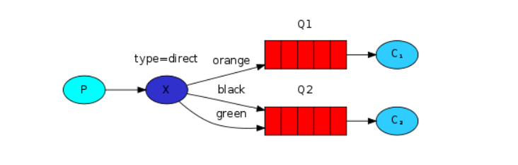
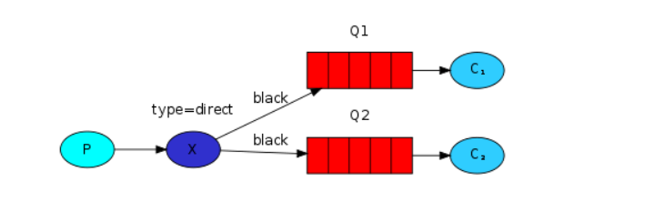

# Routing

In the previous tutorial we built a simple logging system. We were able to broadcast log messages to many receivers.

In this tutorial we're going to add a feature to it - we're going to make it possible to subscribe only to a subset of the messages. For example, we will be able to direct only critical error messages to the log file (to save disk space), while still being able to print all of the log messages on the console.

### Ways to run

If you want to save only 'warning' and 'error' (and not 'info') log messages to a file, just open a console and type:

```
go run receive_log_direct/main.go warning error &> logs_from_rabbit.log
```

If you'd like to see all the log messages on your screen, open a new terminal and do:

```
go run receive_log_direct/main.go info warning error
```

And, for example, to emit an error log message just type:

```
go run emit_log_direct/main.go error "Run. Run. Or it will explode."
```

## Bindings

A binding is a relationship between an exchange and a queue. This can be simply read as: the queue is interested in messages from this exchange.

```
err = ch.QueueBind(
  q.Name, // queue name
  "",     // routing key
  "logs", // exchange
  false,
  nil
)
```

Bindings can take an extra `routing_key` parameter. To avoid the confusion with a Channel.Publish parameter we're going to call it a `binding key`. This is how we could create a binding with a key:

```
err = ch.QueueBind(
  q.Name,    // queue name
  "black",   // routing key
  "logs",    // exchange
  false,
  nil
)
```

## Direct exchange

Our logging system from the previous tutorial broadcasts all messages to all consumers. We want to extend that to allow filtering messages based on their severity. For example we may want the script which is writing log messages to the disk to only receive critical errors, and not waste disk space on warning or info log messages.

We were using a fanout exchange, which doesn't give us much flexibility - it's only capable of mindless broadcasting.

We will use a direct exchange instead. The routing algorithm behind a direct exchange is simple - a message goes to the queues whose binding key exactly matches the routing key of the message.



In this setup, we can see the direct exchange `X` with two queues bound to it. The first queue is bound with binding key `orange`, and the second has two bindings, one with binding key `black` and the other one with `green`.

In such a setup a message published to the exchange with a routing key `orange` will be routed to queue `Q1`. Messages with a routing key of `black` or `green` will go to `Q2`. All other messages will be discarded.

## Multiple bindings



It is perfectly legal to bind multiple queues with the same binding key. In our example we could add a binding between `X` and `Q1` with binding key `black`. In that case, the direct exchange will behave like `fanout` and will broadcast the message to all the matching queues. A message with routing key `black` will be delivered to both `Q1` and `Q2`.

